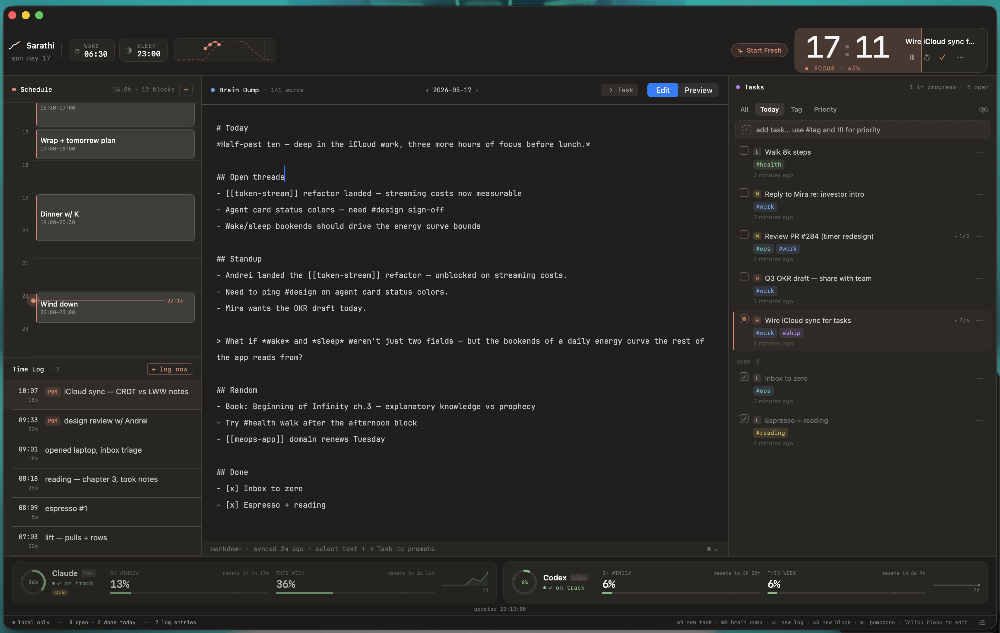

# homebrew-sarathi

Homebrew tap for Sarathi — a focused daily planner for macOS.

## Install

```sh
brew tap k161196/sarathi
brew install --cask sarathi
```

## What is Sarathi?

Sarathi is a minimal macOS app for people who want to own their day without friction. It combines four tools into one focused window:

- **Schedule** — build your day as time blocks on a visual timeline. Click to edit, drag to reshape.
- **Brain Dump** — a full markdown editor for daily notes, thoughts, and working memory. Promotes selected text directly to a task.
- **Tasks** — lightweight task list with tags, priorities, subtasks, and a today filter. Quick-add from anywhere with `⌘N`.
- **Time Log** — timestamped log of what you actually did. Hit `⌘L` to log instantly.

Plus:

- **Pomodoro timer** — focus sessions with work/break modes, shown live in the top bar.
- **Energy curve** — track your energy level through the day alongside your schedule.
- **Agent usage** — monitor Claude and Codex API usage with weekly budgets and burn-rate indicators.

## Screenshot



## Keyboard Shortcuts

| Shortcut | Action |
|---|---|
| `⌘N` | New task |
| `⌘B` | Focus brain dump |
| `⌘L` | New log entry |
| `⌘S` | New schedule block |
| `⌘.` | Toggle pomodoro |
| `⌥`+click block | Edit time block |
| `⌘↵` | Promote selection → task (in brain dump) |
| `Esc` | Cancel / close popover |

## Uninstall

```sh
brew uninstall --cask sarathi
```

Data is stored in `~/Library/Application Support/`. To remove everything:

```sh
brew uninstall --cask sarathi --zap
```

## Requirements

- macOS 14 (Sonoma) or later
- Apple Silicon or Intel Mac

## Version

Current cask: `0.0.2`
